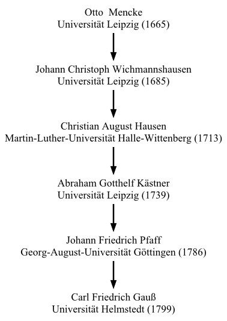
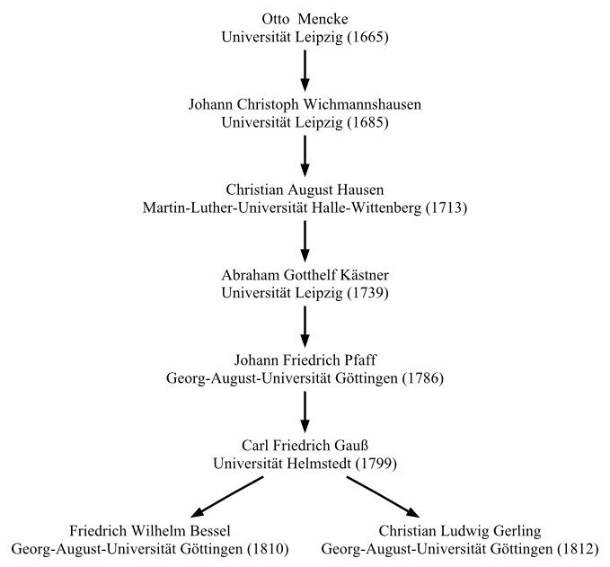

# Geneagrapher
Geneagrapher is a tool for extracting information from the
[Mathematics Geanealogy
Project](https://www.genealogy.math.ndsu.nodak.edu/) to form a
geneagraphy. The output is a dot file, which can be used by
[Graphviz](https://graphviz.org/) to visualize the tree.

## Basic Concepts
The input to the Geneagrapher is a set of starting nodes. If you want
to build the ancestor graph of C. Felix Klein, then C. Felix Klein is
the starting node for that graph. Multiple starting nodes may be
provided (to produce the combined ancestor graph for an academic
department, for instance).

Each individual stored in the Mathematics Genealogy Project's website
has a unique integer as an identifier, and this identifier is what is
passed to the Geneagrapher for starting nodes. The identifier is
embedded in the URL for records in the Mathematics Genealogy Project
website. For example, [Carl
Gauß](https://genealogy.math.ndsu.nodak.edu/id.php?id=18231) is ID
18231 and [Leonhard
Euler](https://genealogy.math.ndsu.nodak.edu/id.php?id=38586) is ID
38586.

Before running the Geneagrapher, go to the [Mathematics Genealogy
Project](https://genealogy.math.ndsu.nodak.edu/) and gather the
identifiers of the starting nodes for the graph you have in mind.

## Geneagrapher Usage
After installing the Geneagrapher, running

```
ggrapher --help
```

should produce

```
Usage: ggrapher [options] ID ...

Create a Graphviz "dot" file for a mathematics genealogy, where ID
is a record identifier from the Mathematics Genealogy Project.
Multiple IDs may be passed.

Options:
  -h, --help            show this help message and exit
  -f FILE, --file=FILE  write output to FILE [default: stdout]
  -a, --with-ancestors  retrieve ancestors of IDs and include in
                        graph
  -d, --with-descendants
                        retrieve descendants of IDs and include in
                        graph
  -v, --verbose         list nodes being retrieved
  -V, --version         print version and exit
```

Explanations of some of the options are given below, followed by
examples.

**-f FILE, --file=FILE**

By default, the Geneagrapher writes the data it generates to standard
output. If you want the data written to file, you need to redirect the
output or use the `-f` or `--file` switch. When one of these switches
is used, the data is saved in the file name provided.

**-a, --with-ancestors**

When one of these switches is provided to the Geneagrapher, an
ancestor graph is generated. An ancestor graph starts with the
starting nodes and the works up to their advisors, their advisors'
advisors, and so on.

**-d, --with-descendants**

These switches instruct the Geneagrapher to extract information about
the descendants of the starting nodes (i.e., their advisees, their
advisees' advisees, and so on).

## Processing the Dot File
To process the generated dot file,
[Graphviz](https://www.graphviz.org/) is needed. Graphviz installs
several programs for processing dot files. For the Geneagrapher, I use
the dot program. Let's look at an example.

If the Geneagrapher has generated a file named "graph.dot", we can do

```
dot -Tpng graph.dot > graph.png
```

This command produces a PNG file containing the graph. That's really
all there is to it. Almost.

### A slightly more complicated process

I find that nicer looking final images are produced by following a
more circuitous route. In the example above, I would run

```
dot -Tsvg graph.dot > graph.svg
```

This produces an SVG file. At this point, I use
[Inkscape](https://inkscape.org) to open the file and export a PNG
file.

A number of other ways to do this are available.

## Examples
_Note: the Mathematics Genealogy Project has added new data since the
examples below were constructed, so if re-run, the results will look
different. The commands, however, all remain correct._

### Single Node Ancestry: Carl Gau&szlig;
To produce the ancestry dot file for Carl Gauß and save it in the file
'gauss.dot', run the command

```
ggrapher -f gauss.dot -a 18231
```



### Multiple Node Ancestry: Friedrich Bessel and Christian Gerling
To produce the combined ancestry dot file for Friedrich Bessel and
Christian Gerling and save it in the file 'bessel_gerling.dot', run
the command

```
ggrapher -f bessel_gerling.dot -a 18603 29642
```



### Single Node Descendant Graph: Haskell Curry
To produce the descendant dot file for Haskell Curry and save it in
the file 'curry.dot', run the command

```
ggrapher -f curry.dot -d 7398
```


Note that descendant graphs often have a lot of "fan out".
